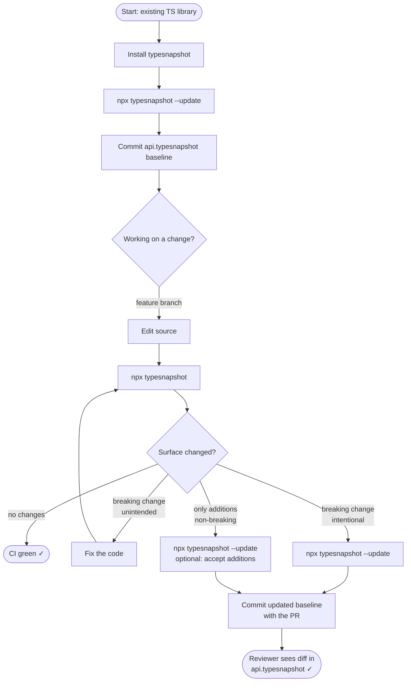

# typesnapshot tutorial

This guide walks you through adding `typesnapshot` to an existing TypeScript library so that accidental breaking type changes are caught in CI before they reach consumers.

## The problem

Your unit tests and `tsc` only verify that code compiles and behaves correctly. Neither catches this:

```ts
// v1.2.0 — someone "cleans up" the interface
export interface QueryOptions {
-  timeout: number        // was required
+  timeout?: number       // now optional — BREAKING for anyone narrowing this type
}
```

The build is green. Tests pass. The patch release ships. Someone's TypeScript project breaks.

`typesnapshot` adds a third check: a committed snapshot of your public type surface that fails CI the moment the surface changes unexpectedly.

---

## Workflow overview



---

## Step 1 — install

```bash
npm install --save-dev typesnapshot
```

`typescript` must already be a dependency (peer or dev). Any version `>=4.7 <6` works.

---

## Step 2 — create the baseline

Point `typesnapshot` at your library's entry point and write the initial snapshot:

```bash
npx typesnapshot --update
# → Wrote 14 exports to api.typesnapshot
```

This creates `api.typesnapshot` in your project root — a plain-text, line-diffable file:

```
// @typesnapshot v1
// typescript 5.4.5

function createClient: (opts: { baseUrl: string; timeout?: number }) => Client
interface Client: { get: (path: string) => Promise<Response>; post: (path: string, body: unknown) => Promise<Response> }
interface QueryOptions: { retries: number; timeout: number }
type StatusCode: 200 | 400 | 404 | 500
```

**Commit this file.** It is the source of truth that CI will check against.

```bash
git add api.typesnapshot
git commit -m "chore: add typesnapshot baseline"
```

If your entry point is not `src/index.ts`, pass it explicitly:

```bash
npx typesnapshot --entry src/public.ts --update
```

---

## Step 3 — add the CI check

Add a script to `package.json`:

```json
{
  "scripts": {
    "typecheck:api": "typesnapshot"
  }
}
```

Then call it from your CI pipeline. GitHub Actions example:

```yaml
# .github/workflows/ci.yml
- name: Check public type surface
  run: npm run typecheck:api
```

`typesnapshot` exits `0` when nothing changed (or only safe additions), and `1` when a breaking change is detected.

---

## Step 4 — day-to-day development

### Nothing changed

```bash
npx typesnapshot
# ✓ Public type surface unchanged.
```

CI passes with no action needed.

### You added a new optional field (non-breaking)

```bash
npx typesnapshot
# Public type surface changed:
#
#   ~ CHANGED  interface QueryOptions  [safe]
#       before: { retries: number; timeout: number }
#       after:  { locale?: string; retries: number; timeout: number }
#
# Only non-breaking additions detected.
#   Run `typesnapshot --update` to accept them into the baseline.
```

Run `--update`, commit the new baseline alongside your code change.

### You made a breaking change — intentionally

```bash
npx typesnapshot
# Public type surface changed:
#
#   ~ CHANGED  interface QueryOptions  [breaking]
#       before: { retries: number; timeout: number }
#       after:  { retries: number; timeout?: number }
#
# ✗ 1 breaking change(s) detected.
#   If intentional, run `typesnapshot --update` and commit the new baseline.
```

This is a major version bump. Update the baseline and include the diff in your PR so reviewers see exactly what changed:

```bash
npx typesnapshot --update
git add api.typesnapshot
git commit -m "feat!: make QueryOptions.timeout optional"
```

The PR will show a clear diff in `api.typesnapshot`. Reviewers don't need to reason about the TypeScript — the file tells them exactly what the surface change is.

### You made a breaking change — by accident

The same output as above, but you didn't mean to. Fix the code until `typesnapshot` passes without `--update`.

---

## Reference

| Command | What it does |
|---|---|
| `typesnapshot --update` | Write or overwrite the snapshot baseline |
| `typesnapshot` | Check current types against baseline; exit 1 on breaking change |
| `typesnapshot --entry src/public.ts` | Use a custom entry point |
| `typesnapshot --snapfile types.snap` | Use a custom snapshot file path |
| `typesnapshot --tsconfig tsconfig.build.json` | Inherit a specific tsconfig |

---

## What counts as breaking

| Change | Classification |
|---|---|
| Export removed | Breaking |
| Required property removed | Breaking |
| Type of existing property changed | Breaking |
| Required property became optional | Safe (widens accepted input) |
| New optional property added | Safe (additive) |
| New export added | Safe (additive) |

When in doubt, `typesnapshot` flags a change as breaking. A false "breaking" warning is annoying; a missed breaking change is the bug that makes the tool worthless.
